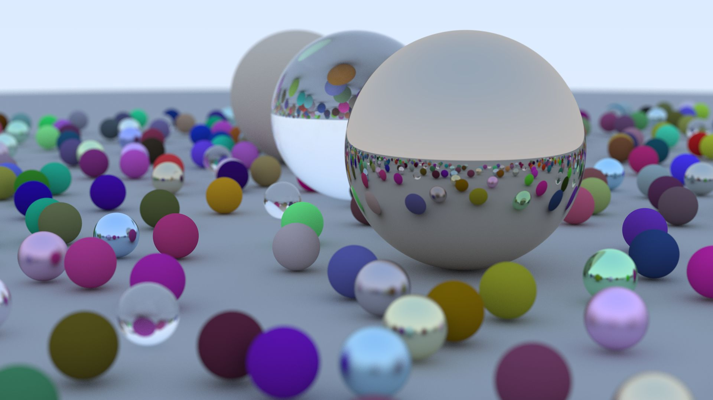

# Ray Tracing in One Weekend with rust

This repository is a rust implementation of 
[Ray Tracing in One Weekend](https://raytracing.github.io/books/RayTracingInOneWeekend.html).

Multi-threading is supported with rayon crate.
`Box<T>` and `&T` are used instead of `Rc<T>` because `Rc` is
not thread-safe and the cost of `Arc<T>` is not necessary because
these structures are simple.

`Box<dyn Texture>` is a Texture, so does material and hittable.
Thus stack-allocated materials and boxed trait objects can both
be passed to spheres as its material to avoid unnecessary boxing.

If you implemented a material pool, you can just pass a
reference of the material and implement `Material` trait of it.

Example (spp=500):

Cornel Box (spp=10000):

Final Scene of Ray Tracing in Next Week (spp=10000):

